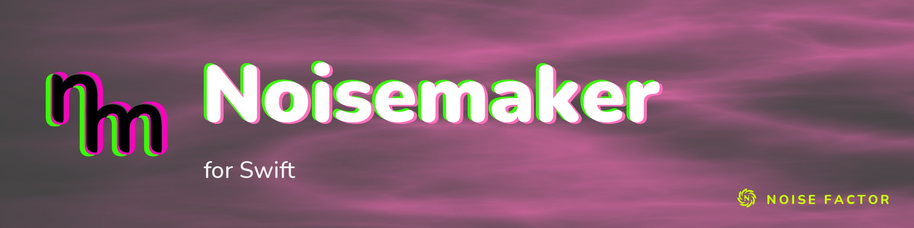

<!-- repo-hero -->
<a href="https://noisemaker.app/"></a>

<sub>Open source from <a href="https://noisefactor.io">Noise Factor</a> &middot; <a href="https://github.com/noisefactorllc">more projects</a></sub>

# Noisemaker for Swift

Open gaps and qualification work are tracked in the repository's
[issues](https://github.com/noisefactorllc/noisemaker-for-swift/issues).

> Run **Noisemaker**'s procedural visuals in **Swift** apps, rendered on **Metal**.

## What is this?

**Noisemaker** is a procedural visual engine. You write short text programs, chains of effects, and
it renders live, animated GPU textures:

```
search synth, filter
noise(scaleX: 60).bloom().write(o0)
render(o0)
```

That language is Noisemaker's **DSL**. The original engine runs in the browser at
[noisedeck.app](https://noisedeck.app).

**Noisemaker for Swift** is a Swift package that runs the same programs natively on Apple GPUs. It
contains a Swift DSL compiler, the bundled catalog of 210 effects, Tint-to-MSL shader translation, a
direct Metal render-graph runtime, and an optional MetalKit viewer. Your application receives Metal
textures for its own rendering, or shows them with the small MetalKit adapter. The effect pipeline
stays on the GPU; Swift performs compilation and orchestration.

It is self-contained: the package runs with no Node.js, Rust, sibling checkout, or network access.

## What you can do with it

- **Render a program into a Metal texture** with `NoisemakerCompiler` and `NoisemakerRenderer`, then
  use that texture in your own Metal pipeline.
- **Supply host input to each frame**: your own textures (`externalTextures:`) and audio and MIDI
  snapshots (`FrameState.inputs`).
- **Show a program in an `MTKView`** with `NoisemakerViewRenderer` from `NoisemakerMetalKit`, and change
  its parameters (`updateParameter(stepIndex:name:value:)`), replace its graph or reset it while it runs.
- **Render a `.dsl` file to a PNG** from the command line with `nm-render`, or preview it in a window
  with `nm-viewer`.

## Requirements

- **A Mac with Apple Silicon** and **macOS 14** or later. The package declares macOS 14 as its
  deployment floor.
- **Swift 6** or later.
- **A native Metal device** to render. The compiler and the CPU test suite need no GPU.
- The qualified configuration is Apple M2, macOS 14.8.3 and Swift 6.0.3 (see
  [What works and what does not](#what-works-and-what-does-not)). iOS and iPadOS, Intel and AMD Macs,
  and other Apple platforms are not qualified yet.

## Install

No packaged release is published yet. Clone the repository and add it to your app as a local Swift
package:

```sh
git clone https://github.com/noisefactorllc/noisemaker-for-swift.git
```

```swift
// In your app's Package.swift
dependencies: [.package(path: "../noisemaker-for-swift")],
targets: [
    .executableTarget(name: "MyApp", dependencies: [
        .product(name: "Noisemaker", package: "noisemaker-for-swift"),
        .product(name: "NoisemakerMetalKit", package: "noisemaker-for-swift"), // optional
    ]),
]
```

The checkout carries prebuilt macOS-arm64 static XCFrameworks for the shader translator and the
raster overlays in `Artifacts/`, so you do not build Tint or Skia. The package is not yet published
as a remote SwiftPM binary product.

## Your first render

```swift
import Metal
import Noisemaker

let compiler = try NoisemakerCompiler()
let graph = try compiler.compile(source: "search synth\nnoise(seed: 1).write(o0)\nrender(o0)\n")

guard let device = MTLCreateSystemDefaultDevice(),
      let queue = device.makeCommandQueue(),
      let command = queue.makeCommandBuffer() else { fatalError("This example needs a Metal device") }

let renderer = try NoisemakerRenderer(device: device, graph: graph,
                                      size: try RenderSize(width: 512, height: 512))
let output = try renderer.encode(frame: FrameState(time: 0.5, delta: 1.0 / 60, frameIndex: 30),
                                 into: command)
command.commit()
command.waitUntilCompleted()
// output.texture is an MTLTexture (rgba16Float) holding the frame.
// Keep `output` while you use the texture.
```

Every DSL program has the same shape:

- Name the namespaces it uses (`search synth, filter`).
- Chain the effects.
- Write the result to an output surface (`.write(o0)`).
- Select a surface to show (`render(o0)`).

To show a program in a window, give an `MTKView` to `NoisemakerViewRenderer`. It becomes the view's
delegate and draws each frame; keep a reference to it:

```swift
import MetalKit
import NoisemakerMetalKit

let view = MTKView(frame: frame, device: MTLCreateSystemDefaultDevice())
let host = try NoisemakerViewRenderer(view: view,
    source: "search synth\nnoise(seed: 1).write(o0)\nrender(o0)\n")
```

From the command line:

```sh
swift run -c release nm-render --dsl program.dsl --out frame.png --width 512 --height 512
swift run -c release nm-viewer --dsl program.dsl
```

`nm-render` also accepts `--time` and `--frames`. `nm-viewer` with no arguments shows a built-in noise
and blur program.

## What works and what does not

- **Full catalog parity on the qualified Mac.** The complete prototype gate passes on Apple M2, macOS
  14.8.3, Swift 6.0.3, against upstream authority `ae42c125df7390c6452617378fd6b20b6fd5b5aa`. Run
  `run.bfqnIfZt` captures 4,421 presented PNG samples per backend across 2,900 cases, including all
  170 timed cases. Results are 2,878 exact and 22 uninformative, with zero near, deferred, skipped,
  failed, missing or refused cases; all 210 effects have informative evidence. Uninformative cases do
  not count toward effect evidence.
- **The compiler matches the reference stage by stage.** The complete 2,900-case compiler corpus
  matches 17,400 pinned source stage hashes.
- **Native suites.** The CPU suite passes 106 tests and the native Metal suite passes 76 tests on
  Apple M2, including resource ownership, queued submissions, partial-write history, sampled 3D
  inputs, parameter updates, and recovery. Timed CLI regressions verify complete sample schedules,
  source-order automation arithmetic, and delta time at loop boundaries. The 100-cycle
  compile/render/resize/dispose test passes with Metal validation and retained downstream consumers.
- **Host content.** The native `fibers`, `scratches` and `strayHair` overlays come from a pinned Skia
  raster artifact. Native builtin and custom OBJ mesh rendering have exact presented-output
  comparisons. Portable storage-texture coverage qualifies the tested single-output numeric-dispatch
  3D subset.
- **Not qualified yet:** performance, physical iOS and iPadOS, Intel and AMD Macs, and public
  distribution. Runtime features are accepted incrementally, with explicit errors for unsupported
  semantics.

Open work includes [typed-array audio](https://github.com/noisefactorllc/noisemaker-for-swift/issues/8),
[upstream resampling and mipmap divergences](https://github.com/noisefactorllc/noisemaker-for-swift/issues/9),
[Portable storage-3D bindings](https://github.com/noisefactorllc/noisemaker-for-swift/issues/10),
[capture cancellation](https://github.com/noisefactorllc/noisemaker-for-swift/issues/12),
[performance measurement](https://github.com/noisefactorllc/noisemaker-for-swift/issues/17),
[iOS and iPadOS](https://github.com/noisefactorllc/noisemaker-for-swift/issues/18),
[upstream explicit-entry-point storage-texture binding](https://github.com/noisefactorllc/noisemaker/issues/320),
and [upstream external-upload test backend selection](https://github.com/noisefactorllc/noisemaker/issues/321).

## How it works

Noisemaker turns a DSL program into a **render graph**, a normalized list of GPU passes. That graph is
the seam every Noisemaker port targets. Noisemaker for Swift ports the compiler to Swift, translates
each effect's WGSL to Metal Shading Language with Tint, and executes the graph directly on Metal.

`OutputLease.texture` is the raw graph output. `nm-render` applies the presentation conversion when it
writes a PNG.

→ **[ARCHITECTURE.md](ARCHITECTURE.md)** (native runtime, shader strategy, graph contract,
qualification) · **[PORTING-GUIDE.md](PORTING-GUIDE.md)** (WGSL-to-MSL translation, resource binding,
Swift semantics, Metal lifetimes) · **[docs/IMPLEMENTATION-PLAN.md](docs/IMPLEMENTATION-PLAN.md)**
(work packages and acceptance checks).

## How it is checked

Use an Apple Silicon Mac with Swift 6 or newer, Python 3, CMake 3.22 or newer, Ninja, Git and
Node.js. The suites use Swift Testing and run with the Swift 6 Command Line Tools. GPU tests require a
native Metal device; a missing Metal device fails them.

```sh
python3 tools/build-tint.py
python3 tools/build-raster.py
swift build
scripts/test
MTL_DEBUG_LAYER=1 scripts/test-metal
python3 tools/package-check.py
```

- `scripts/test` checks source, catalog and corpus freshness, all compiler-stage hashes, automation
  snapshots, CPU input geometry, uniform layout, surface binding, translator behavior, and grader
  integrity without a GPU.
- `scripts/test-metal` runs the native graph, shader, uniform echo and lifetime tests. Lifetime tests
  exercise retained outputs, three bounded submissions, rejected unordered or cross-queue encoding,
  abandoned commands, and unretained command buffers after renderer release or partial encoding
  failure.
- `tools/package-check.py` copies the package sources, both artifacts and their notices into an
  isolated package, then verifies native overlay generation, translation, and a completed Metal frame
  with pixel readback.
- `scripts/parity-summary` runs the complete corpus, mints fresh WebGPU references, renders native
  candidates, and fails on missing, near, failed, or refused cases and until every effect has
  informative strict or exact evidence. A selected-case invocation reports `PARITY-PROBE`; it cannot
  qualify the complete family. The full sweep asserts actual WebGPU; the separate external-upload
  test's WebGL2 fallback is not WebGPU evidence.

The test entrypoints export the authority locked in `parity/reference.json`. Set `NM_REFERENCE_ROOT`
to a clean checkout at that commit to use local sources; otherwise the exporter fetches the locked
sources into a temporary archive. Generated graphs, stage dumps, shader sources, capture protocols
and source hashes stay under `.build/reference`. Unknown or altered authority inputs fail
verification. Define counts describe declared samples, not every accepted numeric literal. The
reference uses locked Playwright 1.63.0 and Chromium 153.0.8010.12, with the native raster artifact
rebuilt against its Skia revision. The qualification fingerprint of the run above is
`36fbaa2e6e2f66fdd91552edd5426eeea969de6600e756fe1b7ed303bcd2149d`, unchanged after capture and
grading; the native executable SHA-256 is
`e68e56a5f30d9e57e738691501f63798807e0fe4c0b7849ccf3cc48cd0188f96`.

To repeat the presented marker comparison and the graph probes on a native WebGPU/Metal host:

```sh
NM_REFERENCE_ROOT=/path/to/locked/noisemaker scripts/parity-marker
NM_REFERENCE_ROOT=/path/to/locked/noisemaker scripts/parity-graph-probes
```

The authority root needs the matching Playwright browser dependencies. It may be a clean locked
checkout or an exact source archive verified against the recorded source manifest. Outputs and
provenance stay in `.build/parity-marker` and `.build/parity-graph-probes`. On Apple M4 the 257×129
asymmetric marker has maximum channel error 0 and SSIM 1.0 against upstream WebGPU. The oracle
copies the actual GPUCanvasContext texture after CanvasSink presentation and records the backing
texture separately; this caught and fixed a vertical presentation mismatch that a comparison of
backing textures alone would have missed. The blur and compute probes pass within one channel value;
the two-attachment MRT and fractional-coordinate sampler probes are exact. A deliberate
linear-sampler mutation fails with maximum channel error 96, confirming that the sampler gate detects
filtering differences. The grader rejects missing output, incorrect dimensions, invalid alpha, color
errors, and flips.

The macOS CI workflow runs the CPU and package checks on every code push. It does not claim GPU
qualification or publish a release.

The raster artifact uses pinned Skia through a narrow C ABI. Its rebuild verifies the source archive
or canonical source tree, GN tool, license, and nine Canvas pixel oracles; source and build
intermediates stay in `.build/skia`. The Tint rebuild fetches the reviewed Dawn/Tint dependency
revisions from `tools/tint/dawn.json`, verifies their source identities, and uses `.build/tint` for
intermediate files.

## Contributing

Contributions follow the Noise Factor
[contributing policy](https://github.com/noisefactorllc/.github/blob/main/CONTRIBUTING.md) and
[Code of Conduct](https://github.com/noisefactorllc/.github/blob/main/CODE_OF_CONDUCT.md).

## Repo layout

```
Sources/Noisemaker/          compiler, graph, runtime, shader translation, bundled catalog and meshes
Sources/NoisemakerMetalKit/  optional MTKView adapter
Sources/NMRender/            nm-render command and corpus runner
Sources/NMViewer/            nm-viewer window
Sources/CNoisemaker*/        C ABI sources that the translator and raster artifacts build from
Artifacts/                   macOS-arm64 static XCFrameworks (Tint translator, Skia raster)
Tests/                       Swift Testing suites
parity/                      authority lock, corpus, golden tooling and graders
scripts/                     test, Metal test and parity entry points
tools/                       Tint and raster rebuilds, reference export, package check
docs/                        implementation plan
```

## License

MIT (see [LICENSE](LICENSE)). Use of the Noisemaker and Noise Factor names in derivative products is
subject to the [Trademark Policy](TRADEMARK.md). Dependency notices for the prebuilt artifacts are in
`tools/tint/LICENSE-*.txt` and `tools/raster/`.

Copyright © 2026 Noise Factor LLC
